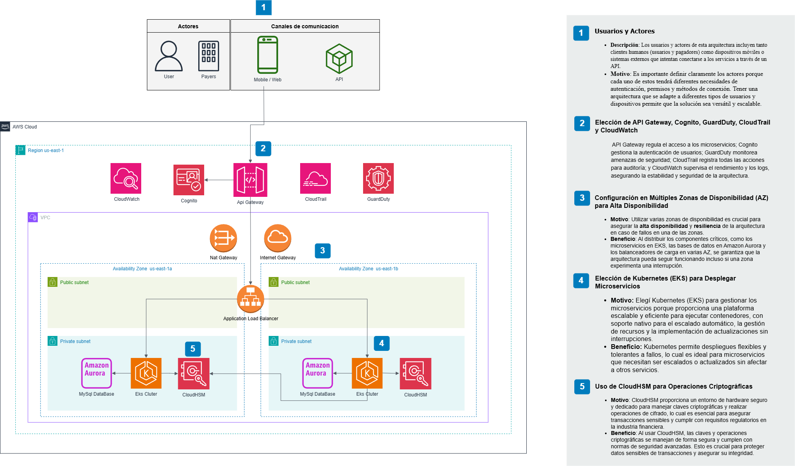

# Proyecto de Pool de Conexiones para Operaciones Criptográficas

Este proyecto demuestra el uso de un **pool de conexiones** para realizar operaciones criptográficas en un entorno simulado con SoftHSM y la biblioteca PKCS #11 en Python. El objetivo es optimizar el rendimiento y reducir la sobrecarga de abrir y cerrar conexiones de sesión repetidamente, especialmente en un contexto de operaciones concurrentes.

## Descripción General

El proyecto incluye los siguientes componentes:

- **`main_pool_optimizado.py`**: Simula operaciones criptográficas utilizando un **pool de conexiones** para manejar múltiples sesiones de forma eficiente.
- **`hms_connection_pool.py`**: Implementa la clase del pool de conexiones, encargada de administrar las sesiones y optimizar su reutilización.
- **`simulation_operations.py`**: Define la función que simula operaciones criptográficas utilizando las conexiones proporcionadas por el pool.
- **`README.md`**: Documentación detallada del proyecto.
- **`arquitectura.png`**: Imagen que muestra el diseño general del pool de conexiones.

## Beneficios del Pool de Conexiones

### ¿Por qué usar un Pool de Conexiones?

En aplicaciones que requieren múltiples operaciones criptográficas concurrentes, abrir y cerrar conexiones repetidamente puede causar **sobrecarga** y **latencia significativa**. Un pool de conexiones gestiona un número limitado de sesiones que pueden reutilizarse para múltiples operaciones, logrando los siguientes beneficios:

- **Reducción de la Sobrecarga**: Al reutilizar conexiones activas, evitamos el tiempo de establecimiento y cierre de sesión en cada operación, reduciendo significativamente el tiempo total de ejecución.
- **Optimización de Recursos**: Un pool de conexiones limita la cantidad de conexiones abiertas simultáneamente, evitando la sobrecarga en el sistema y haciendo un uso más eficiente de los recursos disponibles.
- **Mejor Rendimiento en Operaciones Concurrentes**: En un entorno de concurrencia, el pool permite que las sesiones se distribuyan entre múltiples hilos o procesos, asegurando que no se exceda el número máximo de conexiones permitidas y optimizando el tiempo de respuesta.

### Ejemplo Comparativo

1. **Con Pool de Conexiones (`main_pool_optimizado.py`)**: Los procesos toman conexiones activas del pool, ejecutan sus operaciones y luego devuelven las conexiones para su reutilización. Esto mantiene la **eficiencia y rapidez** en las operaciones concurrentes.

2. **Sin Pool de Conexiones**: Si cada proceso abriera y cerrara una nueva conexión para cada operación, se generaría una carga adicional en el sistema, resultando en un tiempo total de ejecución más largo y un consumo innecesario de recursos. Es por esto que se tomó la decisión de utilizar un pool de conexiones en este proyecto, ya que permite un uso más eficiente de los recursos disponibles.

## Configuración de SoftHSM

Antes de ejecutar el proyecto, debes instalar y configurar SoftHSM para que actúe como un módulo de seguridad de hardware (HSM) simulado.

### Instalación y Configuración de SoftHSM

1. **Instala SoftHSM**: Descarga e instala SoftHSM en tu sistema.
2. **Configura el Directorio de Tokens**: Asegúrate de que el directorio para almacenar los tokens de SoftHSM esté configurado y accesible.

### Inicialización del Token en SoftHSM

Para inicializar un token en el slot 0:

1. **Inicializa el Token** en el slot 0 ejecutando el siguiente comando:

   ```bash
   softhsm2-util --init-token --slot 0 --label "TestToken"
   

Durante el proceso de inicialización, se te solicitará configurar un **SO PIN** (Security Officer PIN) y un **User PIN**. Este último se utilizará en el código para autenticar las conexiones al HSM.

Asegúrate de recordar el **User PIN**, ya que necesitarás especificarlo en el código (en el ejemplo se usa `"1234"` como PIN de usuario). 

Verifica la Inicialización del Token con el siguiente comando:

```bash
softhsm2-util --show-slots
```

## Ejecución del Proyecto

Una vez que el token ha sido inicializado correctamente, puedes ejecutar el script principal (`main_pool_optimizado.py`) para realizar operaciones criptográficas simuladas utilizando el pool de conexiones.

### Pasos para Ejecutar el Proyecto

1. **Instala las Dependencias**: Asegúrate de tener `PyKCS11` instalado en tu entorno de Python.

2. **Ejecuta el Script Principal**: Ejecuta el archivo `main_pool_optimizado.py`, que implementa la arquitectura de pool de conexiones y mide el tiempo total de ejecución, incluyendo el tiempo de cierre de conexiones como parte del overhead.

3. **Observa los Resultados**: El script imprime el tiempo total de ejecución, lo que te permite analizar el impacto del pool de conexiones en comparación con una implementación sin pool.


## Arquitectura del Proyecto

En la raíz del proyecto, se incluye una imagen (`arquitectura.png`) que muestra el diseño general del pool de conexiones:


